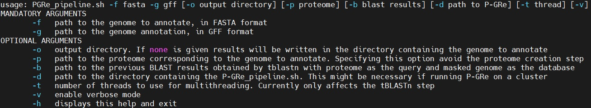
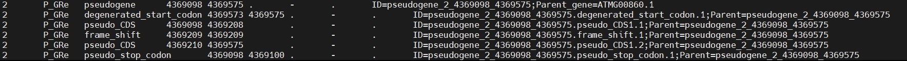

# P-GRe v.0

Contacts and authors
====================
Sébastien Cabanac, PhD student, sebastien.cabanac@univ-tlse3.fr

Christophe Dunand, professor at Université Paul Sabatier Toulouse 3, christophe.dunand@univ-tlse3.fr

Catherine Mathé, associate professor at Université Paul Sabatier Toulouse 3, catherine.mathe-dehais@univ-tlse3.fr

All members of the Laboratoire de Recherche en Sciences Végétales, Université de Toulouse, CNRS, Université Paul Sabatier Toulouse 3, Toulouse INP, Auzeville-Tolosane, France.

Funding and acknowledgements
============================
The authors are thankful to the Paul Sabatier-Toulouse 3 University and to the Centre National de la Recherche Scientifique (CNRS) for granting their work. Sébastien Cabanac is the recipient of a fellowship from the “École Universitaire de Recherche (EUR)” TULIP-GS (ANR-18-EURE-0019). This study is set within the framework of the “Laboratoires d’Excellences (LABEX)” TULIP (ANR-10-LABX-41).

Contents
========

- [Contacts and authors](#contacts-and-authors)
- [Funding and acknowledgements](#funding-and-acknowledgements)
- [About P-GRe](#about-p-gre)
- [Requirements and input](#requirements-and-input)
- [How P-GRe works](#how-p-gre-works)
- [Installation](#installation)
- [Running P-GRe](#running-p-gre)
- [Common problems](#common-problems)
- [Citing P-GRe and associated software](#citing-p-gre-and-associated-software)
- [Licence](#licence)
- [References](#references)

About P-GRe
===========
Pseudogenes are genomic sequences with homology to functional genes but that harbor deleterious mutations, such as loss of the start codon, loss of coding sequence, gain of stop or frame-shifts. No longer coding for a functional protein, pseudogenes are rarely transcribed and are often described as having no function. It is now known that part of the pseudogenes are transcribed, this part representing for example 15% of all the pseudogenes in mice<sup name="a1">[R1](#f1)</sup>. It has also been shown that these transcripts, originating from pseudogenes, could form duplexes with the mRNAs of homologous functional genes and thus participate in post-transcriptional regulation through the RNAi pathway <sup name="a2">[R2, ](#f2)</sup><sup name="a3">[R3, ](#f3)</sup><sup name="a4">[R4](#f4)</sup>. In the other hand, the exhaustive prediction of pseudogenes allow a better understanding of dynamic of gene evolution in multigenenic families often subjected to duplication and pseudogenisation events.

The goal of PseudoGene REtriever (P-GRe [/pɛɡʁ/]) is to find the position of pseudogenes on a genome, as well as to infer their structures in pseudo-exons and pseudo-introns. P-GRe aims to be more user-friendly, with a limited number of dependencies, ease of use and total automaticity, while producing qualitative results and having greater sensitivity than other software with the same goal.

Requirements and input
======================

- Use a high quality genome assembly in FASTA or multi-FASTA format.

- Use an annotation file corresponding to the genome to be annotated in GFF3 format. The GTF format is currently not supported. Genes must be designated by the type "gene" in the third column of this file. CDS must be designated by the type “CDS”, and the gene to which each CDS belongs must be designated by the attribute "Parent" or "Name".

- If a proteome file is provided, it must be in FASTA or multi-FASTA format. For now, each protein present in this file **must** have its correspondence on the annotation file in GFF format. Conversely, each gene in the GFF format annotation file **must** have a correspondence in the proteome file.

How P-GRe works
===============
<p align="center"></p>

P-GRe works in two main stages, themselves divided into several sub-stages. The first main step is the search for the position of pseudogenes on the genome, and the second main step is the refinement of the structure of the pseudogenes found. From the information obtained in the second step, P-GRe can also [assign a type to each pseudogene](docs/figs/cat.md).

## Finding the pseudogenes
(See the numbered sub-steps on gray background on the top figure) The search for pseudogenes is carried out in four sub-steps:

- **[1]** Gene annotation and genome files are used to generate the proteome file. Alternatively, a proteome file can be provided to P-GRe.
- **[2]** Gene positions are used to hard-mask gene loci on the genome.
- **[3]** All protein sequences are aligned locally to the genome. Because the original loci of the protein-coding genes are masked, the proteins will be aligned to areas of the genome with similarity to the original coding gene. It is assumed that the areas of similarity thus found are potential pseudogenes derived from the coding genes, called "parent genes" in the literature.
- **[4]** The results of local alignments are filtered according to several criteria, in particular the percentage of homology between a potential pseudogene and the sequence of the aligned protein. Close hits obtained from alignments of the same sequence are merged together.

## Finding the structure of pseudogenes
(See the numbered sub-steps on black background on the top figure) Pseudogene structure inference is divided into three substeps:

- **[1]** Hits that overlap, and whose overlap length is not divisible by 3, are considered frame-shift markers, because this can show that two parts of a protein sequence encoded by the same CDS are aligned in different reading frames. The presice position of the frame-shift is found by a so-called “chimera” approach. More information on this approach can be found [here](docs/figs/chimeras.md).
- **[2]** The hits obtained may have the defect of not completely covering the (pseudo-)exons of the pseudogenes. To correct this, each hit obtained for a pseudogene is extended to the next hit and translated. Thus, a peptide sequence devoid of frame-shift is obtained, but retaining the introns. By aligning this sequence with the sequence of the protein encoded by the parent gene, extended gaps are expected at the introns loci (Note that an absence of gap marks the presence of a retropseudogene). The alignments obtained are corrected by a process inspired by the Lindley process<sup name="a5">[R5](#f5)</sup>. More information on this "Lindley-inspired" process can be found [here](docs/figs/llp.md).
- **[3]** The ends of the pseudogenes are refined by searching for a start codon and a stop codon. For start codons, P-GRe accepts "degenerate" start codons (*i.e.* which have a single substitution) provided that they are at a precise position upstream of the pseudogene. This position is determined from the alignment between the amino acid sequences encoded by the pseudogene and its parent gene.


Installation
============

### Full dependency installation script

If you don't mind that some software is pre-compiled for Linux, after downloading P-GRe you can go to the `bin` folder and copy/paste the following commands to install all the dependencies:
```
# GFFread
wget https://github.com/gpertea/gffread/releases/download/v0.12.7/gffread-0.12.7.Linux_x86_64.tar.gz
tar xzf gffread-0.12.7.Linux_x86_64.tar.gz
mv gffread-0.12.7.Linux_x86_64/gffread .
rm -r gffread-0*
# BEDtools
wget https://github.com/arq5x/bedtools2/releases/download/v2.30.0/bedtools.static.binary
mv bedtools.static.binary bedtools
chmod 755 bedtools
# NCBI Blast
wget https://ftp.ncbi.nlm.nih.gov/blast/executables/blast+/2.13.0/ncbi-blast-2.13.0+-x64-linux.tar.gz
tar -xvf ncbi-blast-2.13.0+-x64-linux.tar.gz
mv ncbi-blast-2.13.0+/bin/* .
rm -r ./ncbi-blast-*
# BioPython
sudo apt-get install python3-pip
sudo pip3 install biopython
# EMBOSS:6.6.0.0
wget ftp://emboss.open-bio.org/pub/EMBOSS/EMBOSS-6.6.0.tar.gz
tar -xvf EMBOSS-6.6.0.tar.gz
cd EMBOSS-6.6.0
./configure
make
cd ..
cp EMBOSS-6.6.0/emboss/stretcher .
rm EMBOSS-6.6.0.tar.gz
```

If you prefer to install the different dependencies one by one, you can follow the instructions below. At the time of P-GRe testing, these software/dependencies versions were used:

### GFFRead 0.12.7
[GFFRead](https://github.com/gpertea/gffread)<sup name="a6">[R6](#f6)</sup> can be downloaded from [here](https://github.com/gpertea/gffread/releases/download/v0.12.7/gffread-0.12.7.Linux_x86_64.tar.gz) and installed with `make`:
```
wget https://github.com/gpertea/gffread/releases/download/v0.12.7/gffread-0.12.7.Linux_x86_64.tar.gz
tar xzf gffread-0.12.7.Linux_x86_64.tar.gz
cd gffread-0.12.7.Linux_x86_64
make
```
<br>

### BEDTools 2.30.0

A precompiled version of [BEDTools](https://bedtools.readthedocs.io/en/latest/)<sup name="a7">[R7](#f7)</sup> binary can be downloaded from [here](https://github.com/arq5x/bedtools2/releases). Additionally, you should rename the binary file to simply "bedtools" so that P-GRe can work properly:
```
wget https://github.com/arq5x/bedtools2/releases/download/v2.30.0/bedtools.static.binary
mv bedtools.static.binary bedtools
```
Alternatively, you can compile it from source:
```
wget https://github.com/arq5x/bedtools2/releases/download/v2.30.0/bedtools-2.30.0.tar.gz
tar -zxvf bedtools-2.30.0.tar.gz
cd bedtools2
make
```
<br>

### NCBI BLAST+ 2.13.0+

[NCBI BLAST+](https://www.ncbi.nlm.nih.gov/books/NBK279690/)<sup name="a8">[R8](#f8)</sup> latest version can be installed with:
```
sudo apt-get install ncbi-blast+
```
Alternatively, you can download the 2.13.0+ version on which P-GRe was developed from [here](https://ftp.ncbi.nlm.nih.gov/blast/executables/blast+/2.13.0/):
```
wget https://ftp.ncbi.nlm.nih.gov/blast/executables/blast+/2.13.0/ncbi-blast-2.13.0+-x64-linux.tar.gz
tar -xvf ncbi-blast-2.13.0+-x64-linux.tar.gz
```
<br>

### BioPython 1.81
To install [BioPython](https://biopython.org/)<sup name="a9">[R9](#f9)</sup>, you first need to install Python3 package manager with:
```
sudo apt-get install python3-pip
```
You can then install BioPython by using the pip3 package manager:
```
sudo pip3 install biopython
```
<br>

### EMBOSS:6.6.0.0
[EMBOSS](https://emboss.sourceforge.net/)<sup name="a10">[R10](#f10)</sup> tool suite can be downloaded from EMBOSS FTP server (ftp://emboss.open-bio.org/pub/EMBOSS/). Once downloaded you will need to compile with `make`:
```
wget ftp://emboss.open-bio.org/pub/EMBOSS/EMBOSS-6.6.0.tar.gz
tar -xvf EMBOSS-6.6.0.tar.gz
cd EMBOSS-6.6.0/
./configure
make
```
Binary files will be located in the `emboss` folder. This folder contains a lot of binary files. Only `stretcher` is used by P-GRe, but this binary file still needs other binaries to work. The best thing to do is to keep the EMBOSS folder in the `bin` folder, and copy `stretcher` to the `bin` folder.

### Other important informations
P-GRe requires a Linux-system and a Python3 installation. It is known to work with CentOs 7 distribution and Python versions 3.10.0 and 3.6.3. It is currently not possible to specify the path to the binary files. **It is therefore essential to put these different files in the `bin` subfolder of the P-GRe installation folder**. This folder should contains at last the following binary files:
```
bedtools
blastp
gffread
makeblastdb
tblastn
stretcher
EMBOSS-X.X.X (folder)
```

Running P-GRe
=============
P-GRe must be used from the command line. We encourage you to consult the user manual integrated into the software, which can be consulted with the command `./P-GRe_pipeline.sh -h`.
<p align="center"></p>
The most basic command to launch P-GRe would be:

```
./P-GRe_pipeline.sh -f /path/to/genome/fasta_file -g /path/to/annotation/gff3_file
```

## Command line

### Mandatory arguments

`-f` String

Path to the genome file, in FASTA or multi-FASTA format.

`-g` String

Path to the annotation file, in GFF3 format.

### Optional arguments

`-o` String

Output directory. If none is given, the results will be written in the FASTA file folder, in a subfolder named `PGRE_` followed by the date in format day_month_year_hour_min_sec.

`-p` String

Path to the proteome file. If this argument is given, P-GRe skips the step of generating the protein sequence file. :warning: HIGHLY RECOMMENDED.

`-b` String

Path to previous BLAST results. Should only be used to allows P-GRe analysis to be resumed from the end of local alignments in case of a crash.

`-d` String

Path to the directory containing the `P-GRe_pipeline.sh` script. This option may be necessary for running P-GRe on a cluster.

`-t` Interger

Number of threads to use for the local alignements step.

`-v` Boolean

Enable verbose mode.

`-h` Boolean

Displays P-GRe manual.

## Output

The output folder generated automatically or specified via the `-o` option is divided into four subfolders:

- `data` contains a copy of the files provided by the user, from which P-GRe will start its operations.
- `tmp` contains all the working files produced by the different operations and the different software used by P-GRe.
- `log` contains all the files (standard output and standard error) of the different software used by P-GRe. Similar files are generated for each of the P-GRe steps.
- `res` contains the results files, including the coding sequences of the pseudogenes (`pseudogenes.cds.fna`), their genomic sequences(`pseudogenes.genomic.fna`), their corresponding virtually encoded peptides (`pseudogenes.protein.faa`) and the position of the pseudogenes and their structures on the genome (`pseudogenes.gff`, example below). It also contains a `true_gene.id` file containing the id of pseudogenes with no trace of pseudogeneisation.

<p align="center"></p>
Above is an extract from a GFF file generated by P-GRe. P-GRe returns the start and end positions of 5 types of structures: the entire pseudogene, CDS, frame-shifts, pseudo-strat codon or degenerated start codon and stop codon.

## Exemple data

The [`StepByStepGuide.md`](example/StepByStepGuide.md) document in the `example` folder explains in detail how to run an analysis with P-GRe and interpret the results. The data contained in this same folder are a fragment of the sequence of chromosome 1 of *Arabidopsis thaliana* in FASTA format and the GFF file describing this fragment. This 2.5 kb fragment contains a pseudogene that probably appeared by duplication of a gene also located on this fragment.

Common problems
===============

To be added.

Citing P-GRe and associated software
====================================

To be added.

Licence
=======
All source code contained in the `scripts` folder and the `P-GRe_pipeline.sh` file are under the [Artistic Licence 1.0](https://opensource.org/license/artistic-1-0/).

References
==========
<b id="f1">[R1]</b> C. Sisu *et al*. Transcriptional activity and strain-specific history of mouse pseudogenes. *Nat Commun*. Vol. 11, 2020.[↩](#a1)

<b id="f2">[R2]</b> O. H. Tam *et al*. Pseudogene-derived small interfering RNAs regulate gene expression in mouse oocytes. *Nature*. Vol. 453, pp. :534-538, 2008.[↩](#a2)

<b id="f3">[R3]</b> T. Watanabe *et al*. Endogenous siRNAs from naturally formed dsRNAs regulate transcripts in mouse oocytes. *Nature*. Vol. 453, pp. :539-543, 2008.[↩](#a3)

<b id="f4">[R4]</b> P. Guo *et al*. Engineering RNA for Targeted siRNA Delivery and Medical Application. *Adv Drug Deliv Rev*. Vol. 62, pp. :650-666, 2010.[↩](#a4)

<b id="f5">[R5]</b> D. V. Lindley. The Theory of Queues with a Single Server. *Mathematical Proceedings of the Cambridge Philosophical Society*, Vol. 48, pp. :277-289, 1952.[↩](#a5)

<b id="f6">[R6]</b> G. Pertea & M. Pertea. GFF Utilities: GffRead and GffCompare. *ISCB Comm*. Vol. 304, 2020.[↩](#a6)

<b id="f7">[R7]</b> A. R. Quinlan & I. M. Hall. BEDTools: a flexible suite of utilities for comparing genomic features. *Bioinformatics*, Vol. 26, pp. :841-842, 2010.[↩](#a7)

<b id="f8">[R8]</b> A. R. Quinlan & I. M. Hall. BEDTools: a flexible suite of utilities for comparing genomic features. *Bioinformatics*, Vol. 26, pp. :841-842, 2010.[↩](#a8)

<b id="f9">[R9]</b> S. F. Altschul *et al.* Basic local alignment search tool. *Journal of Molecular Biology*, Vol. 215, pp. :403-410, 1990.[↩](#a9)

<b id="f10">[R10]</b> Chapman B & Chang J. Biopython: Python tools for computational biology. *SIGBIO Newsl*, Vol. 20, pp. :15-19, 2000.[↩](#a10)

<b id="f11">[R11]</b> P. Rice *et al.*. EMBOSS: The European Molecular Biology Open Software Suite. *TIG*, Vol. 16, 2000.[↩](#a11)
