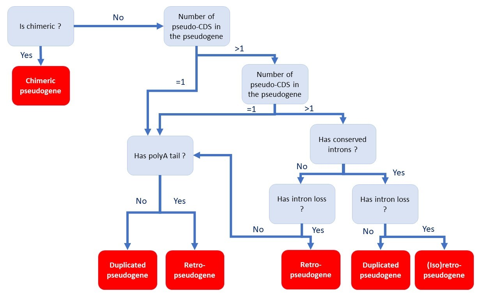
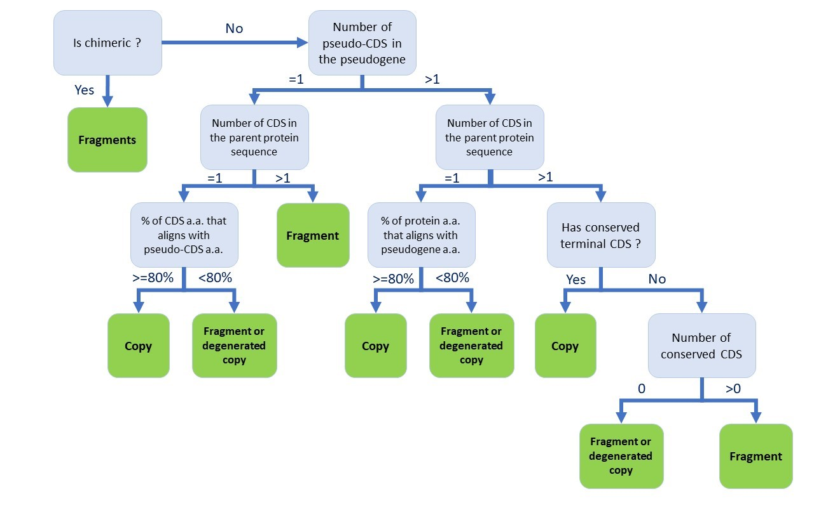

# Categorizing predicted pseudogenes

Types of pseudogene
===================
Three types of pseudogenes are currently known:

- Duplicated pseudogenes, which appear by duplication of a functional gene.
- Retropseudogenes, which appear by the insertion into the genome of a retrotranscribed sequence of an mRNA.
- Unitary pseudogene, which appear by the loss of function of a gene that does not have any paralogue.

To these three types can be added a fourth and fifth type, less known and which can be considered as subtypes of retropseudogene. The first is the chimeric pseudogenes. The mechanism of formation of chimeric pseudogenes is still relatively little known, but it is believed to be the result of template-switching of a reverse transcriptase during the formation of a retropseudogene, leading to the formation of a sequence composed of several subsequences of different mRNAs. The second subtype is the partial retropseudogene, nammed isoretropseudogene in P-GRe. These kind of pseudogene is the result of a retropseudogene generated from an isoform of mRNA. At present, P-GRe can categorize predicted pseudogenes into four types: duplicated pseudogene, retropseudogene, (iso)retropseudogene and chimeric pseudogene. Like no other pseudogene prediction software to our knowledge, P-GRe cannot predict unitary pseudogenes, but we are currently working on this topic. 

To determine the type of pseudogene, P-GRe is based on the following decision tree:

To find losses or retentions of introns, P-GRe will search for conserved CDS (or "high quality CDS"), *i.e.* (pseudo-)CDS of the pseudogene whose encoded sequence produces an alignment with a sequence encoded by a CDS of the parent gene containing less than 20% gap. The presence or absence of intron is then only looked at between two conserved CDS. If no type could be assigned to a predicted pseudogene, a search for poly(A) tail, which is normally present at the 3' end of mRNAs, is performed. For this step, a poly(A) is searched in an area of (maximum) 500 bases following the last position on the 3' side of a pseudogene. A poly(A) tail is considered present if a series of 20 bases containing at least 15 adenines is found in that area. Conversely, it is considered absent if no series of 20 bases with more than 7 adenines is found in this area. Remaining uncategorized pseudogenes take the type "Unknown". "Unknown"-type pseudogenes are very often small fragments of functional genes. They often only correspond to a single CDS, and it is therefore impossible to study the loss or retention of introns on these pseudogenes.

Completness of pseudogene
=========================
Predicted, or annotated, pseudogenes are often smaller in size than their parent gene and in fact correspond to a fragment of them. The explanation for these fragments is not yet known, although hypotheses can be made:

- The fragments come from one or more template-switching during reverse transcription.
- Fragments are the only conserved parts of highly degenerated sequences. This conservation could reveal an important regulatory role via the RNAi pathway.

P-GRe can categorize pseudogenes according to two types of completeness: copy or fragment, relying on this decision tree to do so:

"Conserved CDS" are defined in the same way as for the type. Uncategorized pseudogenes are noted as "fragment or degenerated copy".
