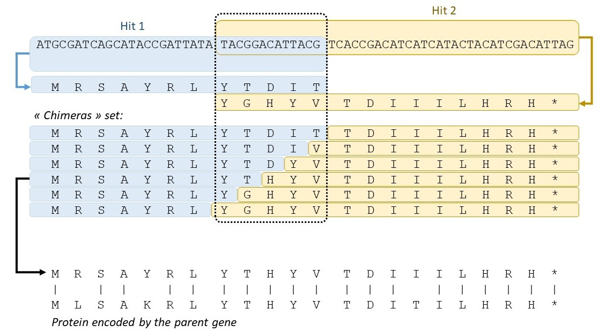

# Frame-shift detection using the chimera approach
P-GRe uses a so-called “chimera” approach to find the position of frame-shifts within pseudogene sequences.

The fictional example above represents the chimera approach. In this example, two hits resulting from local alignments were found at slightly overlapping positions. This overlap is 13 nucleotides long, so it is not divisible by 3 and is considered a frame-shift marker. As the two hits obtained encode different peptides, Hit 2 is truncated on its entire overlapping part to obtain a “chimeric” peptide (See the first sequence of the chimera set). Then, one of the amino acids truncated on Hit 2 is added and, conversely, one amino acid is truncated on Hit 1. By repeating these operations, a set of chimeras is obtained. Each of the chimeric sequences is aligned with the sequence encoded by the parent gene of the pseudogene. The alignment thus obtained having the lowest E-value is retained to determine the position of the frame-shift.
