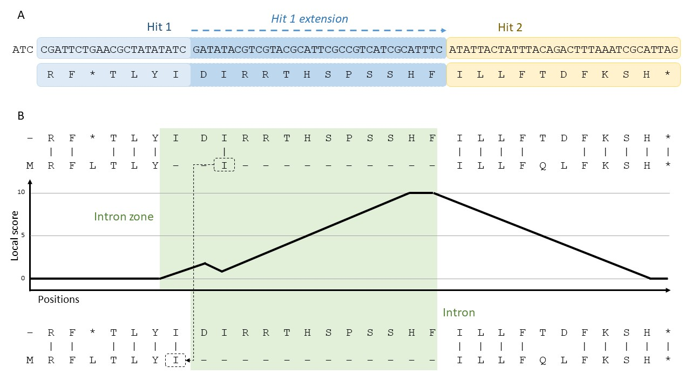

# Correcting semi-global alignments

The alignment between the peptide sequence encoded by the extended-hits pseudogene (See sub-figure A on the top figure) and that of its parent gene is corrected by P-GRe using a process inspired by the Lindley process, thus named "Lindley-like process". In summary, the alignment is scanned from left to right. The process is said to be active when the scan approaches close to a position where a gap is expected. These positions are known to P-GRe thanks to the GFF file, from which the expected length of each CDS is calculated. When the process is active, each position in the alignment is assigned a "local score" equal to the local score of the previous position, +1 if a gap is present on the sequence encoded by the parent gene, and -1 in the opposite case. The initial score when the process is first activated is 0, and this score cannot exceed 10 and be less than 0. The process is deactivated when the score is equal to 0, or if no gap has been observed after 10 positions (which may show intron loss). Once the alignment is scanned, local score “peaks” are obtained along the alignment. They are considered "intron zones", which are more precisely defined as being a longest possible sequence of local scores greater than 0 whose first local score is equal to 1 and whose last local score is equal to the maximum score of this sequence, the latter being greater than or equal to 5.

Finally, alignment errors are corrected. They correspond to the amino acids of the protein encoded by the parent gene which are aligned within an intron region. These amino acids are "glued back" to the other amino acids encoded by their CDS, thus correcting the alignment. Note that for amino acids encoded between two CDSs, the gap is expected before the amino acid and these are therefore considered to be encoded by the second CDS.
